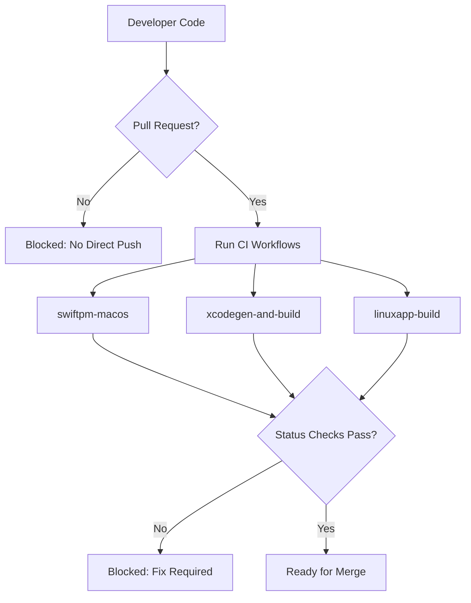
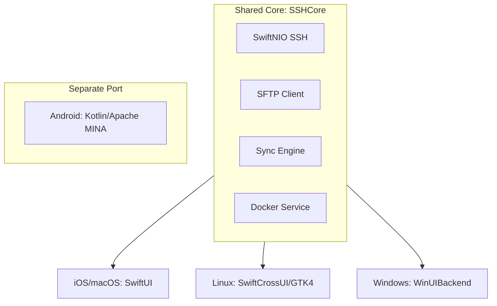

Relevant source files

The following files were used as context for generating this wiki page:

- [AGENTS.md](AGENTS.md)
- [CLAUDE.md](CLAUDE.md)
- [GULDSTANDARD.md](GULDSTANDARD.md)
- [README.md](README.md)
- [VISION.md](VISION.md)
- [SECURITY.md](SECURITY.md)

# Development Standards & AI Agents Guide

## Introduction
The Bastion project maintains a rigorous set of development standards and guidelines designed to ensure cross-platform compatibility and high security for its SSH client. The project utilizes a "Guldstandard" (Gold Standard) approach to repository configuration, ensuring consistency across all related repositories. This guide outlines the architectural constraints, security requirements, and specific instructions for AI agents (such as Claude) interacting with the codebase.

The architecture is built around a shared core module, `SSHCore`, which is written in pure Swift using SwiftNIO to support iOS, macOS, Linux, and Windows. While the core is shared, the UI layers are platform-specific, necessitating distinct build processes and testing strategies for each target.

Sources: [VISION.md:37-41](VISION.md#L37-L41), [README.md:5-10](README.md#L5-L10), [AGENTS.md:4-7](AGENTS.md#L4-L7)

## AI Agent Operating Procedures
AI agents working on the Bastion repository must adhere to specific conventions to maintain the integrity of the cross-platform architecture and security model.

### Agent Constraints and Permissions
Agents are granted specific permissions to facilitate development while strictly forbidden from actions that could compromise repository security or stability.

| Category | Permitted Actions | Forbidden Actions |
| :--- | :--- | :--- |
| **Code Management** | Create branches, modify code, open PRs | Push directly to main, merge PRs, delete branches |
| **Security/Config** | Run tests | Modify secrets, change GitHub org settings, disable workflows |

Sources: [AGENTS.md:14-27](AGENTS.md#L14-L27)

### Development Conventions
*  **Core Logic:** New functionality in the shared `SSHCore` must include unit tests located in `Tests/SSHCoreTests`.
*  **Platform-Specific Builds:** The iOS/macOS `App/` directory is Xcode-only and cannot be verified via `swift build` on Linux.
*  **Dependency Isolation:** The `LinuxApp/` and `WindowsApp/` directories are maintained as separate SwiftPM packages to prevent SwiftCrossUI dependencies from interfering with the root package's build process.
*  **Security Discipline:** Never include unrelated changes in PRs, never commit credentials, and never force push.

Sources: [AGENTS.md:9-12](AGENTS.md#L9-L12), [CLAUDE.md:11-16](CLAUDE.md#L11-L16), [README.md:104-108](README.md#L104-L108)

## Repository "Guldstandard" (Gold Standard)
The project follows a standardized configuration (verified against multiple repositories as of 2026-07-04) to ensure uniform security and maintenance.

### Standardized Files and Automation
Every repository in the organization is expected to contain a set of standard files for licensing, security, and AI guidance.

*  **Documentation:** `LICENSE` (MIT), `SECURITY.md`, `AGENTS.md`, `CLAUDE.md`.
*  **GitHub Templates:** Pull request templates and Issue templates (bug reports, feature requests).
*  **Standard Workflows:** A suite of 8 standard GitHub Action files including `auto-commit.yml`, `auto-label.yml`, `auto-merge.yml`, and `auto-release.yml`.

Sources: [GULDSTANDARD.md:8-17](GULDSTANDARD.md#L8-L17), [GULDSTANDARD.md:21-23](GULDSTANDARD.md#L21-L23)

### Branch Protection and Status Checks
The `main` branch is protected by a ruleset that enforces Pull Requests and specific CI status checks before merging.

The diagram shows the standard PR workflow and the mandatory status checks required to protect the main branch.
Sources: [GULDSTANDARD.md:27-34](GULDSTANDARD.md#L27-L34)

## Security Standards
Security is a primary pillar of the Bastion project. All development must respect the "privacy-friendly" vision of the app.

### Core Security Principles
1.  **Local Encryption:** All data is encrypted locally. Keys never leave the device unencrypted.
2.  **Sync Security:** The `SyncEngine` uses E2E encryption via **AES-256-GCM** with keys derived from a passphrase using **PBKDF2-HMAC-SHA256**.
3.  **OAuth PKCE:** Account integrations (Dropbox, Google Drive, OneDrive) must use OAuth2 + PKCE. No client secrets are stored in the code; only public client IDs are allowed in `App/OAuthProviders.swift`.
4.  **Hardware Integration:** Utilize Face ID/Touch ID and Hardware-backed Secure Enclave where possible.

Sources: [VISION.md:96-98](VISION.md#L96-L98), [README.md:25-30](README.md#L25-L30), [SECURITY.md:52-56](SECURITY.md#L52-L56)

### Vulnerability Reporting
Vulnerabilities must be reported privately via email to `dev@denied.se` or via the GitHub Security tab. Public issues for security flaws are strictly forbidden.

| Stage | Timeframe |
| :--- | :--- |
| Initial acknowledgment | Within 48 hours |
| Assessment | Within 5 business days |

Sources: [SECURITY.md:5-23](SECURITY.md#L5-L23)

## Cross-Platform Architecture
Development must maintain the separation between the core logic and platform-specific UI layers to support the multi-platform vision (iOS, macOS, Linux, Windows, and eventually Android/tvOS/BSD).

The diagram illustrates the architecture where the `SSHCore` serves as the foundation for desktop and Apple platforms, while Android remains a separate implementation due to technical constraints.
Sources: [README.md:12-18](README.md#L12-L18), [CLAUDE.md:7-9](CLAUDE.md#L7-L9), [VISION.md:43-45](VISION.md#L43-L45)

## Conclusion
The Development Standards for Bastion emphasize a "Core-First" philosophy, where security and cross-platform compatibility are built into the `SSHCore` library. By adhering to the Guldstandard repository configuration and strictly following AI agent guidelines, the project ensures a consistent, high-quality experience for both developers and end-users across all supported operating systems. Significant emphasis is placed on end-to-end encryption and the use of native platform features for security and file management.
