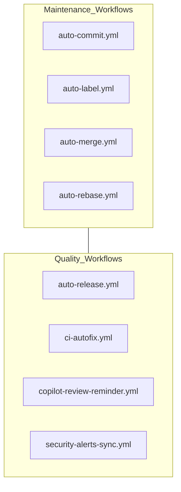

Relevant source files

The following files were used as context for generating this wiki page:

- [GULDSTANDARD.md](GULDSTANDARD.md)
- [.github/pull_request_template.md](.github/pull_request_template.md)
- [SECURITY.md](SECURITY.md)
- [AGENTS.md](AGENTS.md)
- [README.md](README.md)
- [VISION.md](VISION.md)

# Development Standards (Guldstandard)

The "Guldstandard" (Gold Standard) defines the mandatory repository configuration and development practices for the Bastion project and related repositories. It serves as a comprehensive checklist to ensure consistency across multiple platforms, including iOS, macOS, Linux, and Windows, while maintaining high security and code quality benchmarks.

The primary purpose of these standards is to establish a unified baseline for repository structure, automated workflows, branch protection, and security analysis. This ensures that the core logic, residing in `SSHCore`, remains cross-platform compatible and robust across different UI implementations.

Sources: [GULDSTANDARD.md:1-7](GULDSTANDARD.md#L1-L7), [README.md:4-8](README.md#L4-L8)

## Repository Structure and Required Files

Every repository following the Guldstandard must contain a specific set of configuration and documentation files. These files govern licensing, security reporting, AI agent interactions, and automated dependency management.

### Mandatory File Checklist
*  **`LICENSE`**: MIT License.
*  **`SECURITY.md`**: Security policy and vulnerability reporting instructions.
*  **`AGENTS.md` / `CLAUDE.md`**: Guidance for AI agents and automated coding assistants.
*  **`.github/` Templates**: Pull request templates and issue templates (bug reports, feature requests).
*  **`.github/FUNDING.yml`**: Funding configuration (GitHub Sponsors and PayPal).

Sources: [GULDSTANDARD.md:9-18](GULDSTANDARD.md#L9-L18)

### Automated Maintenance
The project utilizes automated tools for dependency updates and repository health. While most repositories use Renovate, Bastion specifically migrated to Dependabot for version updates.

| Tool | Purpose | Configuration File |
|---|---|---|
| Dependabot | Security and version updates | `.github/dependabot.yml` |
| GitHub Actions | CI/CD and automation | `.github/workflows/` |
| Labeler | Automatic PR labeling | `.github/labeler.yml` |

Sources: [GULDSTANDARD.md:20-22](GULDSTANDARD.md#L20-L22), [GULDSTANDARD.md:71-74](GULDSTANDARD.md#L71-L74)

## Automated Workflows

The Guldstandard mandates eight standard GitHub Action workflows to automate repository management.

The diagram shows the categorization of the eight mandatory workflow files used to maintain repository health and automation.

Sources: [GULDSTANDARD.md:24-28](GULDSTANDARD.md#L24-L28)

## Branch Protection and Rulesets

Strict rules are applied to the `main` branch (`refs/heads/main`) to prevent unauthorized changes and ensure code quality through Continuous Integration (CI).

### Rule Configurations
*  **Pull Requests**: Mandatory for all changes; however, the required approving review count is set to 0.
*  **Merge Methods**: Merge, squash, and rebase are all permitted.
*  **Protection**: Non-fast-forward pushes and branch deletions are prohibited.
*  **Status Checks**: Specific CI jobs must pass before merging. For Bastion, these include `swiftpm-macos`, `xcodegen-and-build`, and `linuxapp-build`.

Sources: [GULDSTANDARD.md:32-41](GULDSTANDARD.md#L32-L41)

## Security Standards

Security is a core pillar of the Bastion development process, focusing on protected secret handling and automated scanning.

### Security Controls and Analysis
Bastion deviates from the standard by enabling CodeQL analysis due to "injection-sensitive surfaces" such as Docker command builders and SSH key parsers.

| Setting | Value | Description |
|---|---|---|
| Secret Scanning | Enabled | Detects secrets in the codebase. |
| Push Protection | Enabled | Blocks commits containing secrets. |
| CodeQL / Code Scanning | Enabled | Static analysis for vulnerabilities. |
| Private Vulnerability Reporting | Enabled | Allows researchers to report issues privately. |

Sources: [GULDSTANDARD.md:58-70](GULDSTANDARD.md#L58-L70), [GULDSTANDARD.md:107](GULDSTANDARD.md#L107)

### Contributor Security Requirements
1.  **Secret Management**: Never commit secrets, tokens, or passphrases to the repository.
2.  **PKCE-based OAuth**: Only public client IDs should be stored in `App/OAuthProviders.swift`.
3.  **Local Encryption**: Keys and passwords must never leave the device unencrypted.
4.  **Reporting**: Vulnerabilities must be reported privately via email or the GitHub "Report a vulnerability" button.

Sources: [SECURITY.md:6-14](SECURITY.md#L6-L14), [SECURITY.md:39-45](SECURITY.md#L39-L45), [AGENTS.md:14-16](AGENTS.md#L14-L16)

## Development Conventions

The project follows a specific architecture where core logic is separated from platform-specific UI layers.

### Code Organization
*  **`SSHCore`**: Contains all business logic and SSH transport code. It must be built and tested on both Linux and Apple platforms.
*  **Platform UI**: `App/` (iOS/macOS via SwiftUI), `LinuxApp/` (SwiftCrossUI/GTK4), and `WindowsApp/` (WinUIBackend) are separate targets.
*  **Testing**: New functionality in `SSHCore` requires corresponding tests in `Tests/SSHCoreTests`.

### PR and Commit Standards
The repository requires contributors to sign off on web-based commits. Pull requests should be focused, avoid unrelated changes, and never include credentials.

Sources: [AGENTS.md:8-12](AGENTS.md#L8-L12), [AGENTS.md:27-31](AGENTS.md#L27-L31), [GULDSTANDARD.md:50](GULDSTANDARD.md#L50)

## Conclusion
The Guldstandard ensures that the Bastion project remains a "multi-year platform" rather than just an app. By enforcing consistent repository settings, automated security scanning, and strict branch protection, the project maintains a high level of integrity across its diverse ecosystem of iOS, macOS, Linux, and Windows applications.

Sources: [VISION.md:8-10](VISION.md#L8-L10), [GULDSTANDARD.md:1-5](GULDSTANDARD.md#L1-L5)
