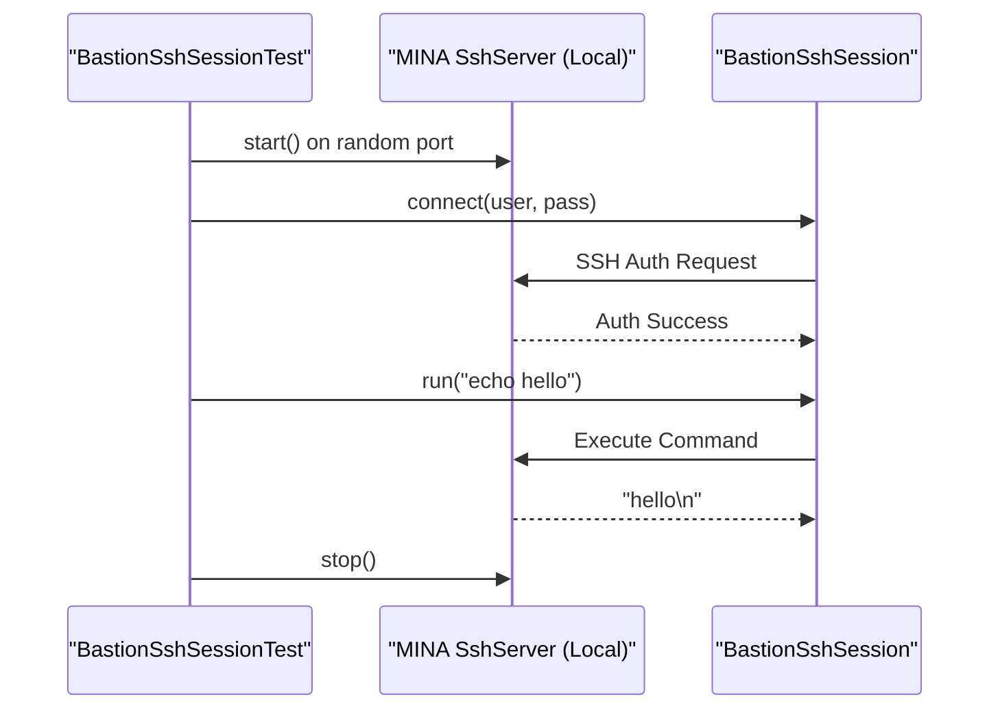
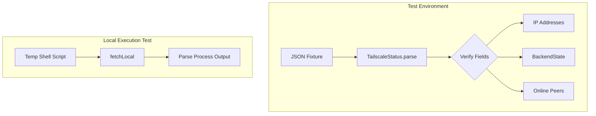

Relevant source files

The following files were used as context for generating this wiki page:

- [README.md](README.md)
- [Tests/SSHCoreTests/SystemProbeTests.swift](Tests/SSHCoreTests/SystemProbeTests.swift)
- [Tests/SSHCoreTests/DockerServiceTests.swift](Tests/SSHCoreTests/DockerServiceTests.swift)
- [Tests/SSHCoreTests/TailscaleStatusTests.swift](Tests/SSHCoreTests/TailscaleStatusTests.swift)
- [Android/app/src/test/kotlin/se/denied/bastion/ssh/BastionSshSessionTest.kt](Android/app/src/test/kotlin/se/denied/bastion/ssh/BastionSshSessionTest.kt)
- [Tests/SSHCoreTests/CommandLibraryTests.swift](Tests/SSHCoreTests/CommandLibraryTests.swift)
- [Tests/SSHCoreTests/WireGuardConfigTests.swift](Tests/SSHCoreTests/WireGuardConfigTests.swift)

# Testing Infrastructure & Mocking

The testing infrastructure in the Bastion project is designed to verify the cross-platform core (`SSHCore`) without requiring external servers or infrastructure. The project prioritizes "In-process" testing, where real protocol handlers are exercised against local loopback services. This ensures that business logic—such as SSH session management, Docker service interaction, and system probing—is verified on Linux, macOS, and Windows.

Sources: [README.md:5-9](README.md#L5-L9), [README.md:167-170](README.md#L167-L170)

## Loopback and In-Process Testing

A defining characteristic of Bastion's testing remains its reliance on in-process servers rather than mocks. For both the Swift-based `SSHCore` and the Android Kotlin implementation, tests instantiate a real SSH server on a random port within the test process. This allows for end-to-end verification of the client path, including authentication, command execution, and data streaming.

### Android Loopback Architecture
The Android implementation uses the Apache MINA SSHD library to set up a `SshServer` for local testing. It verifies authentication success/failure and command output by simulating a real SSH environment.

The test server uses a `SimpleGeneratorHostKeyProvider` for host keys and a `PasswordAuthenticator` to validate credentials against expected test values.
Sources: [Android/app/src/test/kotlin/se/denied/bastion/ssh/BastionSshSessionTest.kt:20-56](Android/app/src/test/kotlin/se/denied/bastion/ssh/BastionSshSessionTest.kt#L20-L56)

## Data Parsing and Fixture Testing

Large portions of the `SSHCore` logic involve parsing command output from remote servers (e.g., `tailscale status`, `docker ps`, `df -h`). The testing infrastructure employs "Fixture Testing," where raw output captured from real Linux environments is fed into parsers to ensure accuracy and prevent regressions.

### System Probe Verification
The `SystemProbeTests` use an extensive multi-section text fixture captured from a real Ubuntu machine. This fixture includes markers like `@@LOADAVG`, `@@MEM`, and `@@DOCKER`.

| Test Case | Description | Source File |
|---|---|---|
| `testParsesFullSnapshot` | Verifies correct extraction of Load, Uptime, Memory, Disk, and Docker containers. | [SystemProbeTests.swift:39-61](SystemProbeTests.swift#L39-L61) |
| `testMissingSectionsAreNil` | Ensures the parser does not crash when sections are missing from the output. | [SystemProbeTests.swift:63-80](SystemProbeTests.swift#L63-L80) |
| `testGarbageOutput` | Confirms that random text yields an empty snapshot rather than an error. | [SystemProbeTests.swift:82-87](SystemProbeTests.swift#L82-L87) |

Sources: [Tests/SSHCoreTests/SystemProbeTests.swift:5-87](Tests/SSHCoreTests/SystemProbeTests.swift#L5-L87)

### Tailscale and WireGuard Config Parsing
Testing for external services like Tailscale and WireGuard follows a similar pattern. `TailscaleStatusTests` utilize real JSON output from `tailscaled v1.98.8`.

Sources: [Tests/SSHCoreTests/TailscaleStatusTests.swift:7-80](Tests/SSHCoreTests/TailscaleStatusTests.swift#L7-L80), [Tests/SSHCoreTests/WireGuardConfigTests.swift:5-115](Tests/SSHCoreTests/WireGuardConfigTests.swift#L5-L115)

## Security and Injection Testing

Because Bastion constructs shell commands (e.g., for Docker management), the testing suite includes explicit checks for shell injection vulnerabilities. The `DockerServiceTests` verify that malicious input is correctly rejected before it can reach the command builder.

### Injection Test Examples
The suite tests a variety of "bad" references to ensure they throw a `DockerError.invalidReference`.
*  **Semicolons**: `plex; rm -rf /`
*  **Command Substitution**: `$(whoami)` or `` `id` ``
*  **Pipes and Logical Operators**: `a|b`, `a&&b`
*  **Quotes and Redirection**: `a'b`, `a>b`

Sources: [Tests/SSHCoreTests/DockerServiceTests.swift:11-20](Tests/SSHCoreTests/DockerServiceTests.swift#L11-L20)

## Utility and Library Testing

The infrastructure also covers static resources and utility functions to ensure consistency across the application.

*  **Command Library**: `CommandLibraryTests` ensure that all entries have unique IDs and that every category defined in the vision (Docker, Linux, Git, etc.) is represented. Sources: [Tests/SSHCoreTests/CommandLibraryTests.swift:5-18](Tests/SSHCoreTests/CommandLibraryTests.swift#L5-L18)
*  **WireGuard Round-tripping**: `WireGuardConfigTests` verify that a configuration can be parsed and then rendered back to text without losing data, ensuring idempotency in the configuration editor. Sources: [Tests/SSHCoreTests/WireGuardConfigTests.swift:85-88](Tests/SSHCoreTests/WireGuardConfigTests.swift#L85-L88)

## Conclusion

Bastion's testing infrastructure leverages a combination of in-process protocol servers, real-world data fixtures, and aggressive injection testing. This multi-layered approach ensures that the core `SSHCore` library remains stable across iOS, macOS, Linux, and Windows, while providing a reliable foundation for the platform-specific UI layers.
