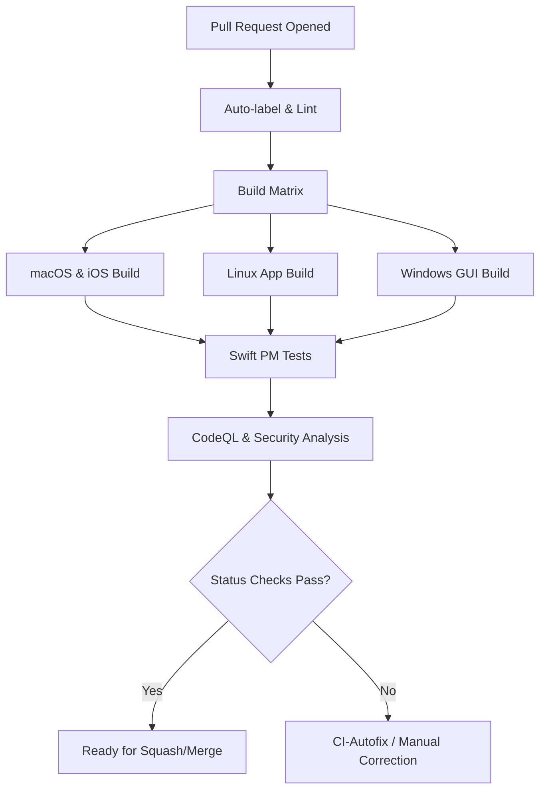
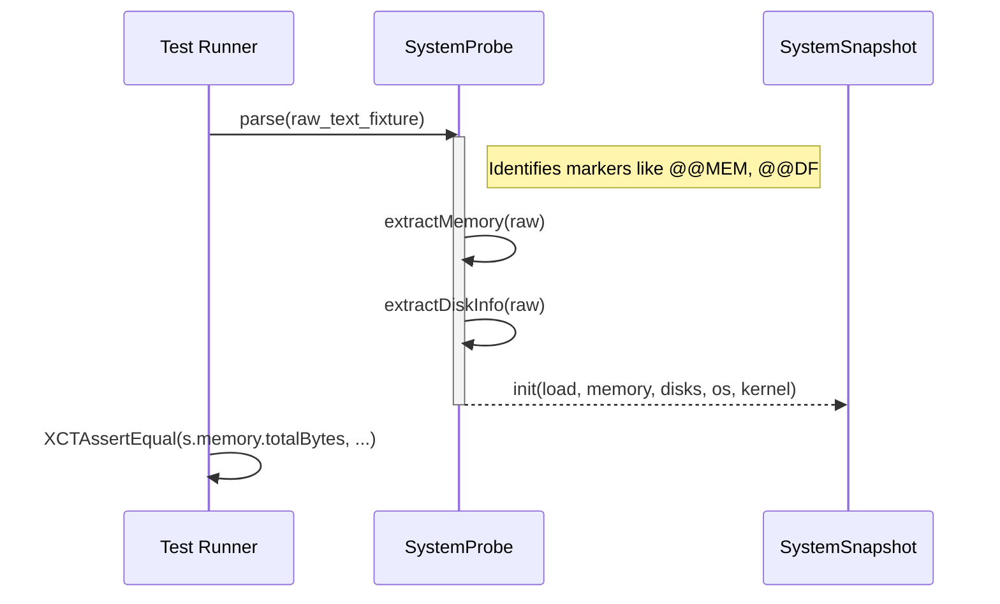

<details>
<summary>Relevant source files</summary>

The following files were used as context for generating this wiki page:

- [Tests/SSHCoreTests/CommandLibraryTests.swift](Tests/SSHCoreTests/CommandLibraryTests.swift)
- [Tests/SSHCoreTests/SystemProbeTests.swift](Tests/SSHCoreTests/SystemProbeTests.swift)
- [Tests/SSHCoreTests/DockerServiceTests.swift](Tests/SSHCoreTests/DockerServiceTests.swift)
- [Tests/SSHCoreTests/WireGuardConfigTests.swift](Tests/SSHCoreTests/WireGuardConfigTests.swift)
- [README.md](README.md)
- [GULDSTANDARD.md](GULDSTANDARD.md)
- [Package.swift](Package.swift)
</details>

# Automated Testing Infrastructure

The Automated Testing Infrastructure in Bastion is designed to ensure the reliability and security of its core SSH transport, data parsing, and system integration logic across multiple platforms including iOS, macOS, Linux, and Windows. The infrastructure leverages a combination of unit tests, integration tests with in-process SSH servers, and automated CI/CD pipelines to validate functionality without requiring external server dependencies.

The core testing philosophy centers on validating the `SSHCore` library, which contains the application's business logic. Tests are executed via standard Swift toolchains (`swift test`) and specialized GitHub Actions workflows to ensure cross-platform compatibility and protect the `main` branch from regressions.

Sources: [README.md:12-14](README.md#L12-L14), [README.md:144-148](README.md#L144-L148), [Package.swift:49-56](Package.swift#L49-L56), [GULDSTANDARD.md:16-24](GULDSTANDARD.md#L16-L24)

## Test Architecture and Components

The testing suite is primarily organized within the `Tests/SSHCoreTests` directory. It utilizes the `XCTest` framework and is structured to verify individual services and protocol implementations.

### Core Testing Strategies
*  **In-Process SSH Server:** Integration tests instantiate a real SSH server within the test process on a random port. This allows the testing of the full client-to-server data path without external infrastructure.
*  **Parser Validation:** Extensive use of "fixtures" (real-world output samples) to test parsers for system snapshots, Docker listings, and WireGuard configurations.
*  **Security Injection Testing:** Specific tests are dedicated to ensuring that user-provided strings cannot lead to command injection when building remote execution strings (e.g., Docker commands).

Sources: [README.md:144-148](README.md#L144-L148), [Tests/SSHCoreTests/SystemProbeTests.swift:4-31](Tests/SSHCoreTests/SystemProbeTests.swift#L4-L31), [Tests/SSHCoreTests/DockerServiceTests.swift:11-20](Tests/SSHCoreTests/DockerServiceTests.swift#L11-L20)

### Test Component Summary

| Component | Test File | Responsibility |
| :--- | :--- | :--- |
| **Command Library** | `CommandLibraryTests.swift` | Validates unique IDs, category coverage, and snippet rendering. |
| **System Probe** | `SystemProbeTests.swift` | Parses remote system output (load, memory, disk, OS) into typed snapshots. |
| **Docker Service** | `DockerServiceTests.swift` | Validates container reference sanitization and command string builders. |
| **WireGuard Config** | `WireGuardConfigTests.swift` | Validates `.conf` file parsing, comment stripping, and round-trip serialization. |
| **SSH Core** | `Package.swift` | Defines `SSHCoreTests` target with `NIOEmbedded` dependency for async testing. |

Sources: [Tests/SSHCoreTests/CommandLibraryTests.swift:4-10](Tests/SSHCoreTests/CommandLibraryTests.swift#L4-L10), [Tests/SSHCoreTests/SystemProbeTests.swift:33-40](Tests/SSHCoreTests/SystemProbeTests.swift#L33-L40), [Tests/SSHCoreTests/DockerServiceTests.swift:22-31](Tests/SSHCoreTests/DockerServiceTests.swift#L22-L31), [Tests/SSHCoreTests/WireGuardConfigTests.swift:45-55](Tests/SSHCoreTests/WireGuardConfigTests.swift#L45-L55), [Package.swift:49-56](Package.swift#L49-L56)

## Continuous Integration (CI) Pipelines

Bastion employs a rigorous CI infrastructure through GitHub Actions. The "Guldstandard" (Gold Standard) defines a set of mandatory workflows that every repository in the organization should follow to maintain high quality.

### Pipeline Flow
The following diagram illustrates the automated flow from a Pull Request to a verified state.



The CI infrastructure ensures that changes do not break builds on any supported platform, especially given the platform-specific UI layers.
Sources: [GULDSTANDARD.md:12-24](GULDSTANDARD.md#L12-L24), [README.md:158-164](README.md#L158-L164), [README.md:200-205](README.md#L200-L205)

### Security and Vulnerability Scanning
Bastion deviates from the standard organizational configuration by enabling **CodeQL Analysis**. This is prioritized due to the project's high sensitivity to injection attacks in its Docker command builders and SSH key parsers.
Sources: [GULDSTANDARD.md:61-64](GULDSTANDARD.md#L61-L64)

## Data Parsing and Verification Logic

A significant portion of the test infrastructure is dedicated to verifying the correctness of data extraction from remote SSH command outputs.

### System Probe Parsing
The `SystemProbeTests` verify that raw text from commands like `uptime`, `df`, and `/proc/meminfo` are correctly mapped to Swift structures. The test suite ensures that missing sections in the output do not cause crashes but instead result in `nil` fields.



Sources: [Tests/SSHCoreTests/SystemProbeTests.swift:33-68](Tests/SSHCoreTests/SystemProbeTests.swift#L33-L68)

### Security-Focused Validation
The `DockerServiceTests` include specific validation logic to prevent command injection. They test that container names or image references containing shell metacharacters (e.g., `;`, `|`, `&&`, `$()`) are strictly rejected before a command is ever constructed.

```swift
func testValidateRejectsInjection() {
    for bad in ["plex; rm -rf /", "a b", "$(whoami)", "`id`", "a|b", "a&&b",
                "", "-flag", "x\ny", "a'b", "a\"b", "a>b"] {
        XCTAssertThrowsError(try DockerService.validate(bad)) { error in
            XCTAssertEqual(error as? DockerError, .invalidReference(bad))
        }
    }
}
```

Sources: [Tests/SSHCoreTests/DockerServiceTests.swift:11-20](Tests/SSHCoreTests/DockerServiceTests.swift#L11-L20)

## Configuration and Toolchain Requirements

The testing infrastructure requires specific environments to execute successfully, particularly for the GUI components.

*  **Swift Version:** Core tests run on Swift 5.9+. However, the `LinuxApp` GUI tests require a toolchain newer than 6.1.3 (e.g., Swift 6.5-dev) to avoid compiler crashes related to `swift-mutex`.
*  **Dependency Pinning:** `swift-nio` is pinned to version `2.86.2` to circumvent Sendable/IPPROTO errors on Windows, ensuring the CI pipeline remains green for Windows builds.
*  **Environment Variables:** Certain tests, such as `WireGuardConfigTests`, can utilize environment variables (e.g., `BASTION_TEST_WIREGUARD_PRESHARED_KEY`) for dynamic configuration, falling back to safe defaults if absent.

Sources: [Package.swift:23-35](Package.swift#L23-L35), [LinuxApp/Package.swift:5-15](LinuxApp/Package.swift#L5-L15), [Tests/SSHCoreTests/WireGuardConfigTests.swift:5-7](Tests/SSHCoreTests/WireGuardConfigTests.swift#L5-L7)

The Automated Testing Infrastructure ensures that Bastion remains a reliable, "standalone" SSH client. By verifying the `SSHCore` logic independently of the platform-specific UI targets, the project maintains high code quality and security standards across iOS, macOS, Linux, and Windows.
